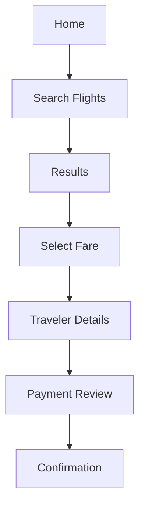

# User Flows

## Customer Booking Flow
1. User lands on the homepage.
2. User searches for flights.
3. User reviews options and selects a fare.
4. User enters traveler details.
5. User reviews payment summary.
6. User confirms booking.
7. User receives confirmation and itinerary.

## Cancellation Flow
1. User opens booking history.
2. User selects a booking.
3. User initiates cancellation.
4. User reviews refund or credit policy.
5. User confirms action.
6. User receives status update.

## Admin Support Flow
1. Admin opens support queue.
2. Admin filters tickets or bookings.
3. Admin reviews issue and status.
4. Admin resolves or escalates action.
5. Admin records outcome and closes the case.

## Mermaid Flow Diagram

